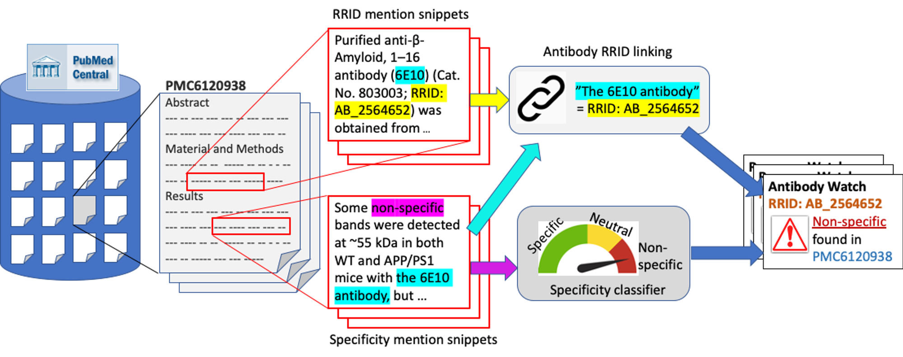

# Antibody-Watch
## Text Mining Antibody Specificity from the Literature

Antibody-Watch aims to automatically alert scientist users of problematic antibodies by extracting statements about antibody specificity reported in the literature.

We divided the problem into two tasks (See figure below). 
* Task 1 (Specificity classifier; see folder [ABSA](ABSA/)) classifies a snippet about antibody specificity and test if the snippet report any antibody that is nonspecific, and thus problematic. 
* Task 2 (Antibody RRID linking; see folder [rrid](rrid/)) links each of these snippets to one or more antibodies that the snippet referred to. We leveraged the Research Resource Identifiers (RRID) to precisely identify antibodies linked to the extracted specificity snippets. 

**Authors**: Chun-Nan Hsu, Chia-Hui Chang, Thamolwan Poopradubsil, AmandaLo, Karen A. William, Ko-Wei Lin, Anita Bandrowski, Ibrahim Burak Ozyurt, Jeffrey S. Grethe, and Maryann E. Martone

**Affiliations**: Department of Neurosciences and Center for Research in Biological Systems, University of California, San Diego, La Jolla, CA92093, USA.
Department of Computer Science and Information Engineering, National Central University, Zhongli, Taoyuan 32001,Taiwan.
SciCrunch, Inc. San Diego, CA, US
