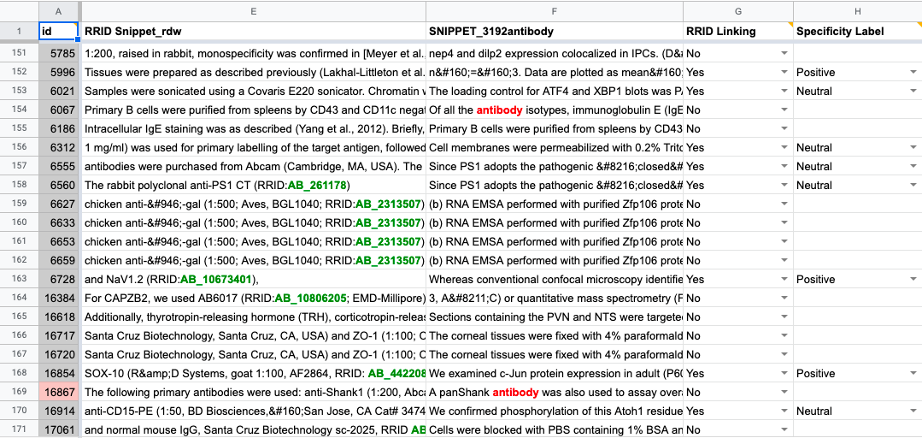
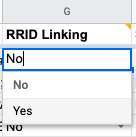
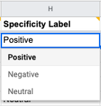
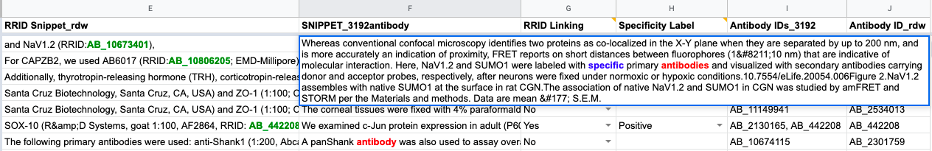

# Supporting Information
## Antibody Watch: Text Mining Antibody Specificity from the Literature (Hsu et al.) 
### Supplementary Figure 1 Annotation interface screenshots.

1.1 Annotation interface on Google Sheets.

1.2 RRID linking options.

1.3 Specificity labeling options.

1.4 Color highlighting of antibodies and their specificities.

### Section 3 AEN, LCF and Siamese BiLSTM 

The Attentional Encoder Network (AEN) employs attention based encoders for the modeling, since recurrent neural networks are difficult to parallelize and may truncate backpropagation through time, which brings difficulty in remembering long-term patterns. The network consists of four layers which are Embedding layer, Attentional Encoder layer, Target-specific Attention layer, and Output layer. In our implementation, we chose BERT as its embedding layer. The output from this layer is fed to the Attentional Encoder layer. The Attentional Encoder layer is a parallelizable and interactive alternative of LSTM and is applied to project the hidden states of the input embeddings. This layer consists of two submodules: the Multi-Head Attention (MHA) and the Pointwise Convolution Transformation (PCT). After we obtained the introspective context representation and the context-perceptive target representation, we then applied another MHA to obtain the target-specific context representation. For the Output layer, the final representation is computed by average pooling, concatenating them and using a fully connected layer to project the concatenated data.

A Local Context Focus (LCF) Mechanism for Aspect-Based Sentiment Classification is based on a view of local context word which is related to the target aspects by utilizing self-attention to capture local context features and global context features concurrently. This model also used Semantic-Relative Distance (SRD) to help locate the local context of each target aspect by evaluating the dependency between contextual words and target aspects. The network is separated into two parts. The first part is called global context. The input and process of this part is similar to BERT-SPC. The second part is called local context. The first part is word embedding whose input is the snippet. The second part is feature extraction or local context focus with the use of SRD to help locate the local context of each target aspect. The inputs of this feature extraction are both the snippet and aspect word. The output from global context will be concatenated with the output from local context which is the result from multiplying the output from BERT with the output from local context focus. We applied MHSA to interactively learn the features of the global context. For the Output layer, the result from the previous layer is pooled by extracting the hidden states on the corresponding position of the first token. Finally, a Softmax layer is applied to predict the sentiment polarity.

The Siamese Recurrent Architectures were shown to be effective for the sentence similarity classification. They consist of two recurrent network components trained to have identical parameters (thus the name “Siamese”) to read a pair of different input sentences. Then the difference between the output of the two components is computed to determine if the input sentences are similar. We implemented this architecture by using a bi-directional long-short term memory (biLSTM) as the recurrent layer to encode a snippet into a vectorized representation. For the last layer, we consider both Manhattan distance and Euclidean distance of the encoded vectors to measure the similarity between the input sentence pair.
