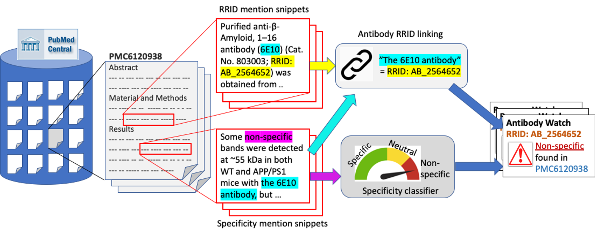

**Motivation**: Antibodies are widely used experimental reagents to test expression of proteins. However, they might not always provide the intended tests when they do not specifically bind to the target proteins that their providers designed them for, leading to unreliable research results. We developed a system to automatically alert scientist users of problematic antibodies by extracting statements about antibody specificity reported in the literature.

**Results**: We developed a deep neural network system and tested its performance with a corpus of more than two thousand articles that reported uses of antibodies. We divided the problem into two tasks. Given an input article, the first task is to identify snippets about antibody specificity and classify if the snippets report any antibody that is nonspecific, and thus problematic. The second task is to link each of these snippets to one or more antibodies that the snippet referred to. We leveraged the Research Resource Identifiers (RRID) to precisely identify antibodies linked to the extracted specificity snippets. The result shows that it is feasible to construct a reliable knowledge base about problematic antibodies by text mining.

[**Supplementary Information** (Click Me)](https://github.com/SciCrunch/Antibody-Watch/blob/master/SupplementaryInformation.md)

**Authors**: Chun-Nan Hsu, Chia-Hui Chang, Thamolwan Poopradubsil, AmandaLo, Karen A. William, Ko-Wei Lin, Anita Bandrowski, Ibrahim Burak Ozyurt, Jeffrey S. Grethe, and Maryann E. Martone

**Affiliations**: Department of Neurosciences and Center for Research in Biological Systems, University of California, San Diego, La Jolla, CA92093, USA.
Department of Computer Science and Information Engineering, National Central University, Zhongli, Taoyuan 32001,Taiwan.
SciCrunch, Inc. San Diego, CA, US
